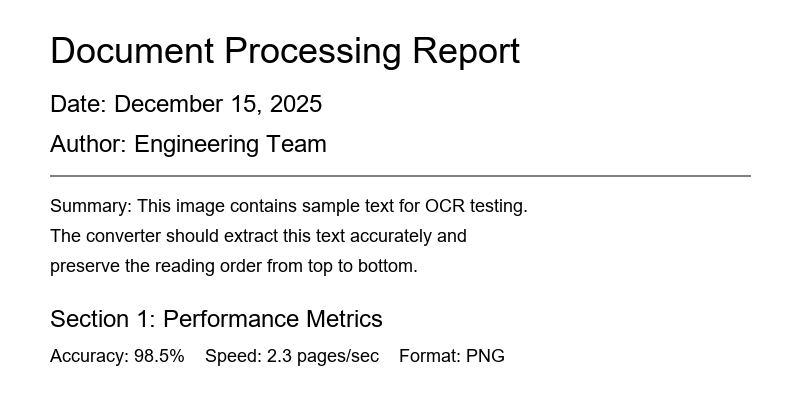

> Conversion confidence: High.

## sample_ocr_image

### Extracted Text

Document Processing Report Date: December 15, 2025 Summary: This image contains sample text for OCR testing. Section 1: Performance Metrics
Author: Engineering Team The converter should extract this text accurately and Accuracy: 98.5% Speed: 2.3 pages/sec Format: PNG
preserve the reading order from top to bottom.

*OCR Engine: tesseract | Confidence: High*
